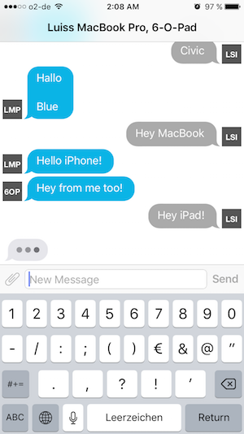

# march-thirteen
Local Chat Application with MultiPeerConnectivity.

## How it works

The app opens a service via MultiPeerConnectivity and at the same time advertises
itself as a peer and browses for other peers. If any peers are found, invitations
are sent out automatically. Received invitations are accepted automatically.

Messages can then be send to all connected peers, sort of like a group chat.

No additional networking logic on top of MultiPeerConnectivity is implemented (yet).

## Screenshot

## WalkieTalkie

All of the networking logic is contained in the WalkieTalkie folder which might
later be refactored into a separate library.

The main component is the `Communicator` class. This is a generic class
encapsulating networking. You use this to send and receive messages. 

Messages are serialized & deserialized using a combination of generic protocols.

`Communicator` is specialized on the `CommunicatorOutput` protocol. This can be
anything you like it to, e.g. in this application it represents a `ChatEvent`.
The `CommunicatorOutput` protocol also defines a payload type, which is the actual
object that will be sent over the wire.

Serialization is done via the `CommunicatorPayload` protocol. A payload has to 
know how to represent itself as a dictionary and how to construct itself from 
such a dictionary.

This dictionary is then sent over the wire and arrives on the other side. There
the `Communicator` creates a `CommunicatorMessage` object, which includes the
deserialized payload and some meta information (like the associated peer).

This message object is used to instantiate an `CommunicatorOutput` instance
which takes the message and transforms it into an application level object.

This all plays together to create a seamless serialisation & deserialisation logic
without any action needed on the calling side.

### Example Usage

For a concrete usage example please see the `ChatRoom.swift` file. There all the 
application level objects for the chat are defined implementing the needed 
protocols.